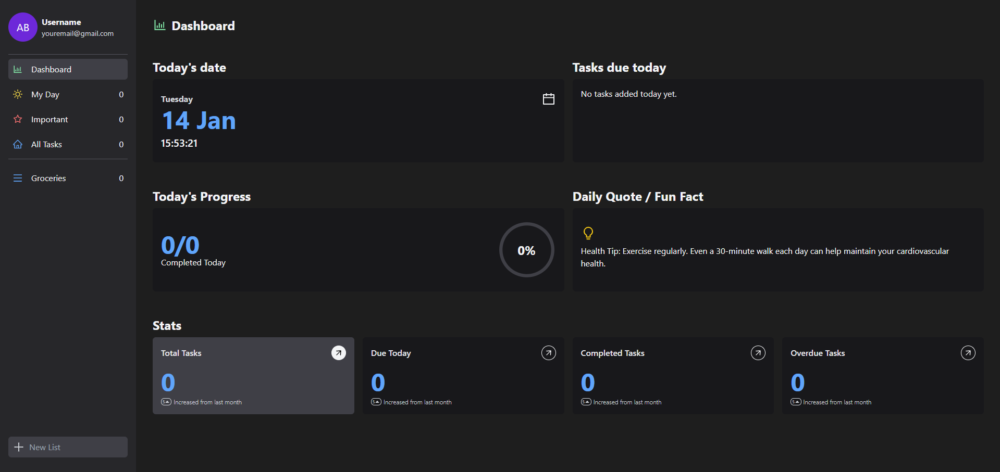

###### Todo App

### Introduction
Welcome to the TODO App, a personal project designed to enhance productivity and task organization while honing my skills in TypeScript and Zustand. This application provides a clean and intuitive interface for managing tasks and custom lists, combining modern design with robust functionality.

## Screenshot



### Features
- Add tasks with detailed descriptions to effectively capture actionable items.
- Mark tasks as important to prioritize essential activities.
- Toggle task completion status to visually track progress.
- Edit task names to accommodate evolving requirements or updates.
- Delete tasks to maintain a clutter-free and relevant task list.
- Monitor overall progress and productivity metrics via an interactive dashboard.
- Create and customize task lists for specific projects or categories.
- Rename lists to reflect changes in scope or focus.
- Perform comprehensive CRUD operations on tasks within custom lists to ensure complete control over task management.
- Experience a user-friendly interface designed for efficient navigation and task handling.

### Technologies Used
- **React**: Core framework for building the user interface.
- **React-Router-dom**: For routing between different pages of the app.
- **React-icons**: Icon library used for adding scalable vector icons.
- **Tailwind CSS**: Utility-first CSS framework for styling
- **Vite**: Development server and build tool for fast project setup.
- **TypeScript**: Adds static typing to JavaScript, enhancing code quality and maintainability.
- **Motion**: Animation library for creating smooth, interactive animations.
- **Zustand**: State Management for handling app-wide state.

[](https://skillicons.dev)

### Installation
## Installation
1. Clone the repository:
   ```bash
   git clone https://github.com/your-username/your-repo-name.git

2. Navigate to the project directory:
   ```bash
   cd your-repo-name

3. Install Dependencies:
   ```bash
   npm install

4. Run the Development Server:
   ```bash
   npm run dev

## Usage
- After starting the development server, navigate to `http://localhost:3000` to see the Todo application.
- Add tasks, toggle their importance or completion status, and organize them into custom lists.
- Monitor your progress with the dashboard and enjoy a streamlined task management experience.

### Contributing
Contributions are welcome! Please feel free to submit a Pull Request or open an issue if you find any bugs or improvements.

## Contact
Created by [Karl Petter Nordgaard](https://github.com/karlpnord) - feel free to reach out!
